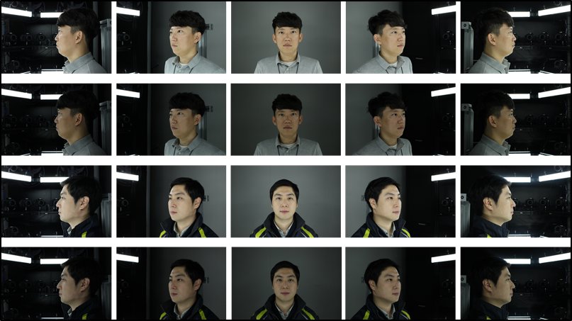
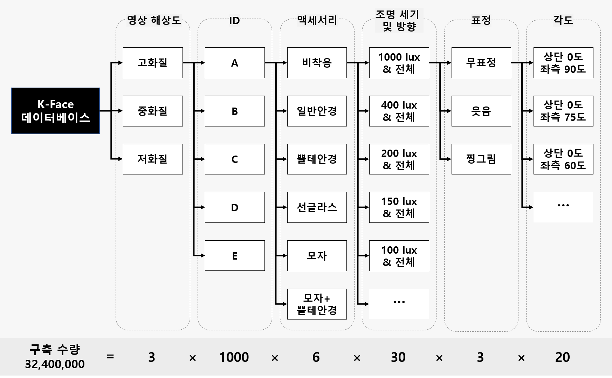
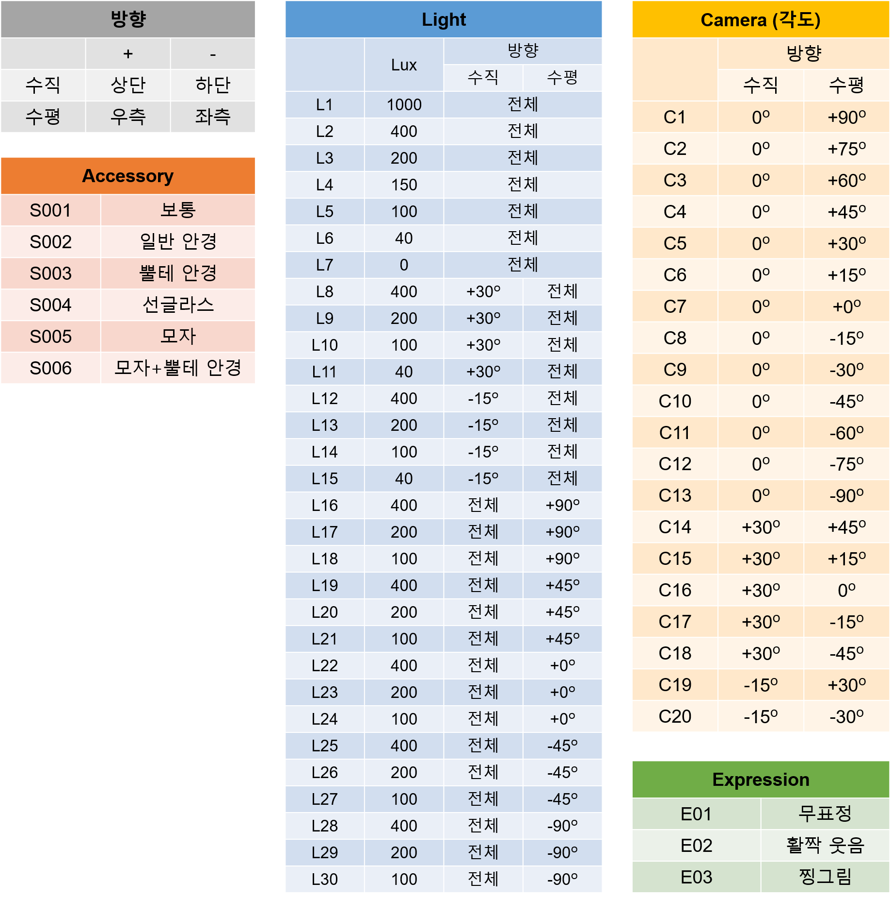
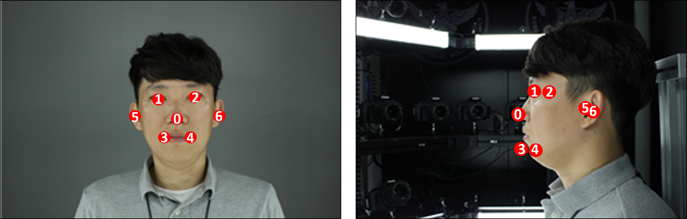
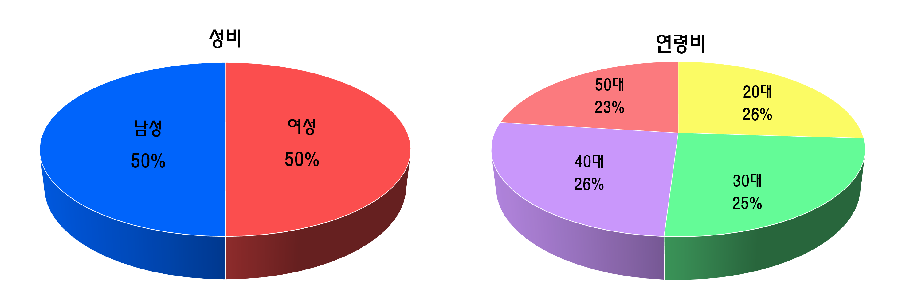
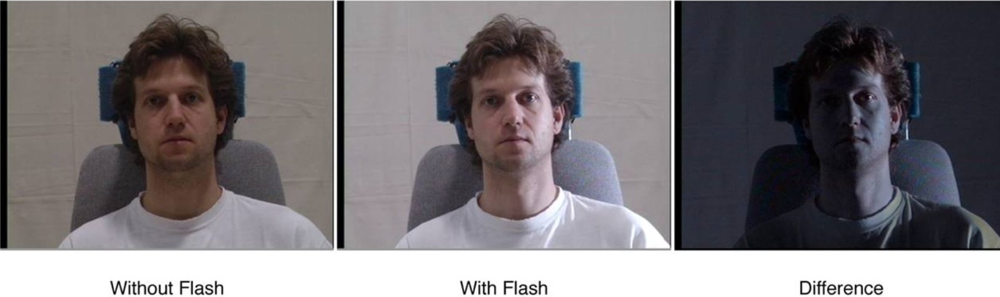
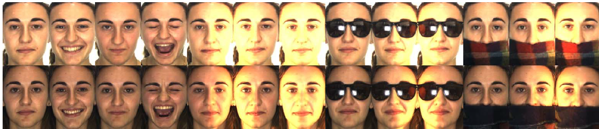
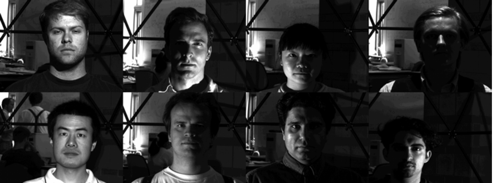
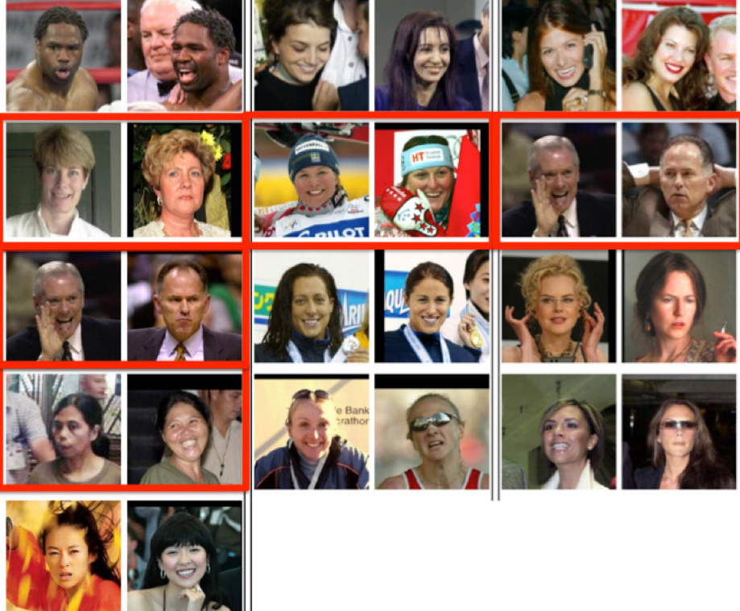

# KFACE Dataset

##### 그림 1. 한국인 얼굴 이미지 데이터베이스 구조 이미지 예시

한국인 안면 이미지 데이터는 한국정보화진흥원 (NIA) 지능정보산업 인프라 조성 사업의 세부 과제인 영상정보지식베이스 구축 사업의 일환으로 구축되었습니다. 연구 목적으로 활용되는 얼굴 데이터베이스는 대부분 해외에서 구축됨에 따라, 한국인들의 얼굴 특성에 맞는 한국형 얼굴 데이터베이스가 필요합니다. 이에 본 데이터 구축은 한국인 얼굴의 통계적 특징을 파악하기 위함을 목적으로 하고 있습니다. 한국인 안면 이미지 데이터는 총 1000명의 데이터를 보유하고 있습니다. 얼굴 데이터의 실효성 제고를 위해 각도 20종, 조도 30종, 액세서리(가림) 6종, 표정 3종, 해상도 3종을 반영하여 인당 약 3만장에 해당하는 데이터가 구축되었습니다. KFACE 예시는 그림 1. 에 보여집니다.  

# Download the Data
KFACE 데이터셋은 'AI open innovation hub (http://www.aihub.or.kr)' 사이트의 안면데이터 부분 혹은 데이터 공유 사이트 (http://kface.kist.re.kr) 에서 이용 가능합니다. 사이트 가입이 필요하며 이미지 신청을 하시면 다운로드 받으실 수 있습니다. 이미지 데이터를 다운로드하기 위해 데이터를 제공하는 연구기관(KIST) 사이트로 이동합니다.
KFACE 데이터셋에 대한 자세한 데이터 정보는 하단을 참고해주시기 바랍니다.  

# Sample Code
[얼굴 인식](https://github.com/k-face/k-face_2019/tree/master/samples/recognition)
 
[얼굴 생성](https://github.com/k-face/k-face_2019/tree/master/samples/generation)
   

# 촬영 장치 운용
### 촬영 장비
* 장비 총 4대를 운용하여 촬영 진행했습니다.
* 카메라 정보
  * Cannon EOS 100D(장비 4번)/1500D(장비 1, 2, 3 번) 20대
  * M 모드에서 조리개 4.5, ISO 400 
* 카메라 위치
  * 위로 30도: 30도 및 15도 간격(즉, 45도, 15도, 0도, -15도, -45도) 5대, 90도 커버
	* 정면: 15도 간격 13대, 180도 커버
	* 하단 15도: 65도 간격 2대(즉, 30도, -30도), 60도 커버 

##### 그림 2. 촬영 장비 예시  

### 카메라 데이터 수신 장비 및 프로그램 정보
* 카메라 데이터 수신 장비
  * 메모리 문제로 인해 두 대의 데스크탑을 사용, 한 대 당 DSLR 카메라 10대 연결했습니다.
* 촬영 컨트롤 프로그램
  * 'CameraControl.exe' 사용
  * 조명 조절 프로그램이 연동되어 있으며, 이에 LightID 를 조명 프로그램에서 설정된 ID를 이용하여 불러옵니다.  

# 데이터 구성 및 설명
얼굴 이미지 데이터베이스의 구조는 영상 해상도(high, middle, low), ID, 가림(액세서리 유무), 조명 위치 및 세기, 표정, 포즈 방향을 고려하여 설계되어 있습니다.
구축 수량: 32,400,000장=1000명×32,400장 (즉, 해상도3 × 액세서리6 × 조명30 × 표정3 × 각도20)
파일명은 영상 해상도 별로 “ID_액세서리속성_조명속성_표정속성_포즈속성.jpg”으로 구분하며 각 파일 당 얼굴 영역 정보를 텍스트 파일로 별도 저장합니다.

파일 저장 시 각 요소 별 Label 정보는 다음과 같습니다.
1. 해상도 3종 (High [864, 576], Middle [346, 230], Low [173, 115])
2. 액세서리 6종 (S001 ~ S006)
3. 조명 30종 (L1 ~ L30) (조도 30 lightings)
4. 표정 3종 (E01 ~ E03)
5. 각도 20종 (C1 ~ C20) (20 views)

##### 그림 3. 한국인 얼굴 이미지 데이터베이스 구조 이미지 예시  

<b>파일명: ID_액세서리속성_조명속성_표정속성_포즈속성 (그림 3 참고)</b>

* <b>ID</b>: 8자리 숫자로 구성. 1~6자리-사진 촬영 날짜 (예, 190716), 7번째 자리-장비 번호 (예, 4), 8번째 자리-해당 날짜 촬영 순서 (예, 1)로 참가자에게 개별적으로 부여되는 번호(예, 19년도 7월 16일, 장비 4번, 1번째 촬영; 19071641)입니다.

* <b>액세서리 속성</b>: S001 ~ S006 에 해당되며, S001: 보통(일반 상태), S002: 일반 안경 착용, S003: 뿔테 안경 착용, S004: 선글라스 착용, S005: 모자 착용, S006: 모자+뿔테 안경 착용

* <b>조명 속성</b>: L1 ~ L30에 해당되며, 각 번호에 따라 조도(Lux), 방향(수직, 수평, 다른 각도) 정보가 다릅니다[그림 4 참고].

* <b>표정 속성</b>: E01 ~ E03에 해당되며, E01: 무표정, E02: 활짝 웃는 표정, E03: 찡그린 표정입니다.

* <b>포즈 속성</b>: 카메라 위치에 따라 달라지는 포즈 속성으로 C1 ~ C20에 해당됩니다. 포즈는 수직과 수평 그리고 각각의 다른 각도 정보를 지니고 있습니다.

한 모델이 촬영한 다양한 속성에 해당하는 데이터는 모두 동일한 ID에 들어있습니다. 

##### 그림 4. 데이터 조건 세부 사항  

# 촬영 데이터 특징점 정보
### 특징점 위치 및 인덱스

##### 그림 5.특징점 위치 및 인덱스 예시 (얼굴사진출처: CMU Multi PIE face database) 

* 특징점 인덱스 정보
  * 0: 코 끝
  * 1: 오른쪽 눈 중심
  * 2: 왼쪽 눈 중심
  * 3: 오른쪽 입꼬리
  * 4: 왼쪽 입꼬리
  * 5: 오른쪽 귀 중심
  * 6: 왼쪽 귀 중심
  * 측면 영상에서 액세서리로 인해 해당 위치가 보이지 않는 경우, 해당 위치를 예측하여 예측된 위치에 특징점 보정 

* 바운딩 박스(Bounding box)
  * 바운딩 박스는 얼굴, 눈, 코, 입, 귀 영역을 지정함
  * 얼굴 영역은 약간의 여유 공간 (배경을 포함)을 포함하여 지정
  * X 축 중심은 양안 중심 (미간), y축 중심은 눈과 코의 중간점을 기준으로 함 
  * 얼굴 영역 바운딩 박스는 정방형으로 지정
  * 측면의 경우 눈과 귀는 보이는 면만 지정 
  * 인덱스 정보 (0 : 얼굴 전체 /  1: 오른쪽 눈 / 2: 왼쪽 눈 / 3: 코 / 4: 입 / 5: 오른쪽 귀 / 6: 왼쪽 귀)
  * 아래 예시 그림 참조
  

##### 그림 6. Bounding box 예시 (얼굴사진출처: CMU Multi PIE face database) 

* 특징점 및 바운딩 박스 검출 대상 
  * 촬영 각도: 촬영되는 모든 각도
  * 조명(4 종류): L1 (1000 Lux), L3 (200 Lux), L6 (40 Lux), L7 (0 Lux)
  * 표정(3종류): E01 (무표정), E02 (활짝웃음), E03 (찡그림)
  * 액세서리(1종류): S001 (보통) 

* 1인당 검출 결과
  * 특징점: 2268개 = 특징점 7개 X 촬영각도 27개 X 조명 4종류 X 표정 3종류
  * 바운딩박스: 2268개 (or 1620개) = 바운딩박스 7개(or 5개) X 촬영각도 27개 X 조명 4종류 X 표정 3종류  

# 데이터셋의 인구통계학적 분포

촬영자의 인구통계학적 분포는 균일한 성비와 연령비를 따릅니다.
- 촬영자 수: 총 1001명
- 성별: 남성(500명), 여성(501명)
- 연령: 20대(265명), 30대(250명), 40대(256명), 50대(230명)

##### 그림 7. 데이터의 인구통계학적 분포  

# Benchmarks
* CMU Multi PIE face database

##### 그림 8. CMU Multi PIE face database 예시 

* AR face database

##### 그림 9. AR face database 예시 

* Extended YaleB database

##### 그림 10. Extended YaleB database 예시 

* LFW face database

##### 그림 11. LFW face database 예시  

# 활용 예시
* 산업분야
  * 한국인 안면 이미지의 기계학습을 통한 얼굴인식기술의 고도화로 모바일 금융보안서비스, 출입보안시스템, 범죄용의자 탐색시스템, 매장방문 고객지원 서비스 등 얼굴인식기반 서비스 가능
  * 한국인 안면 이미지의 기계학습을 통한 한국인 얼굴생성모델의 개발로 사용자 맞춤형 아바타 제작 서비스, 가상 영상 제작 서비스 가능
* 연구분야
  * 얼굴 탐지(Detection), 얼굴 복원(Restoration), 얼굴 인식(Recognition), 얼굴 생성 및 변환(Generation & Translation) 기술의 고도화, 효율화, 일반화 연구 가능  

# 참고문헌
* <b>Multi-pie</b>: Gross, Ralph, et al. "Multi-pie." Image and Vision Computing 28.5 (2010): 807-813.
* <b>AR face database</b>: Zhang, Yu, and Dit-Yan Yeung. "Semi-supervised discriminant analysis using robust path-based similarity." 2008 IEEE Conference on Computer Vision and Pattern Recognition. IEEE, 2008.
* <b>Extended YaleB database</b>: Struc, Vitomir, and Nikola Pavesic. "From Gabor magnitude to gabor phase features: tackling the problem of face recognition under severe illumination changes." Face Recognition. IntechOpen, 2010.
* <b>LFW face database</b>: Learned-Miller, Erik, et al. "Labeled faces in the wild: A survey." Advances in face detection and facial image analysis. Springer, Cham, 2016. 189-248.
